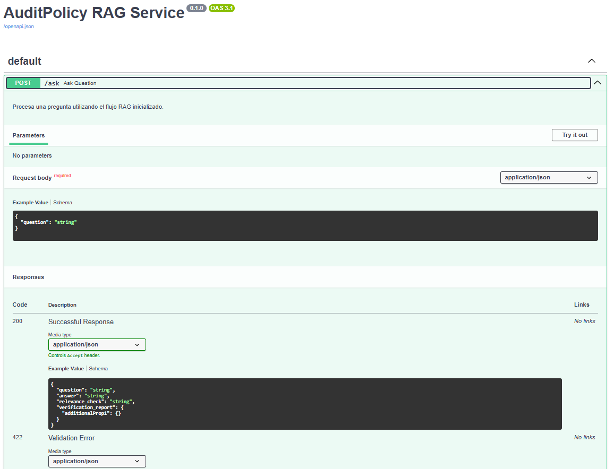
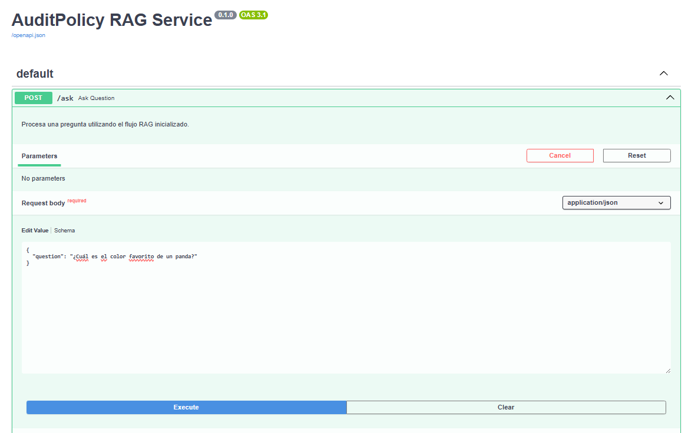
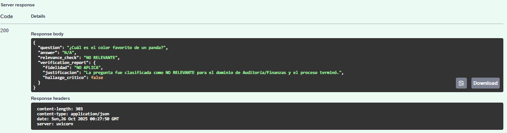

[Versión en Español](README.md)

# Multi-Agent System for Financial Auditing - AuditPolicy 🛡️
This project implements an advanced Retrieval-Augmented Generation (RAG) system designed to answer complex auditing and accounting questions with high fidelity and robustness. It uses a LangGraph Agent architecture to orchestrate a comprehensive quality control workflow, ensuring that responses are strictly based on financial standards documentation (IFRS, IAS, SOX, etc.).

The goal is to demonstrate an enterprise AI solution that prioritizes accuracy, traceability, and backend stability (FastAPI) for potential scalability as required.

## Data Source 💾

The project uses a set of normative and regulatory documents commonly used in auditing practice, including excerpts from:

-   International Financial Reporting Standards (IFRS) and International Accounting Standards (IAS).
-   US regulations (SOX) and specific implementation guidelines (IFRIC).

Accuracy Note: Tests show that the direct response to highly specific queries (e.g., detailed sections of SOX or IFRIC) depends on the completeness of the corpus of uploaded documents. VerificationAgent works correctly by marking accuracy as LOW when the context is insufficient, demonstrating the traceability of the system.


## Technologies Used 🐍
This project is a demonstration of generative AI backend engineering, using a robust Python technology stack:

-   LangGraph & LangChain: Advanced multi-agent workflow orchestration and RAG pipeline management.
-   FastAPI: Implementation of the high-performance RESTful API backend to serve the RAG service.
-   Ollama (Llama 3.1): Local Language Model server, used for classification and response generation, prioritizing privacy and low inference cost.
-   ChromaDB: Persistent vector database used for semantic storage and retrieval of embeddings.
-   HuggingFace Embeddings & BM25: Implementation of a hybrid CustomRetriever for accurate document search.
-   PyPDFLoader & RecursiveCharacterTextSplitter: Tools for ingesting and preparing audit and standards PDF documents.

## Installation Considerations ⚙️

To configure and run this RAG API service, it is important to understand the flow requirements:

Ollama: You must have Ollama installed and running to serve the llama3.1:8b model.
bash:
    ```
    ollama run llama3.1:8b
    ```  
    
Python environment: It is recommended to use a virtual environment (conda).

Install the necessary Python libraries.
bash:
    ```
    pip install -r requirements.txt
    # (o listar manualmente: langchain-core, langgraph, langchain-ollama, 
    # langchain-community, fastapi, uvicorn, pydantic, nltk)
    ```  
    
Data and Environment Configuration
-   Create a folder called Data Files in the project root directory.
-   Place all regulatory PDF files (IFRS, SOX, etc.) inside the Data Files folder.
-   The first run will perform a FULL ingest, creating the chroma_db directory and the persisted_chunks.pkl file.

And the execution must be through the terminal to be used:
bash:
    ```
    uvicorn RAG_SYS_API:app --reload
    ```  

## Usage Example 📎

The backend exposes a single key endpoint for RAG queries. After running the server through the terminal, you will have a deployment of the type http://localhost:8000/docs



The most important edge case for validating the RelevanceChecker is an out-of-domain query.   



The system immediately terminates the flow and injects a fake verification report to avoid 500 errors in the API:



A complex question that requires synthesis and verification has the result of the relevance check (RELEVANT) and the quality verification report according to the ingested data.


## Contributions 🖨️

If you're interested in contributing to this project or using it independently, consider:
-   Forking the repository.
-   Creating a new branch (git checkout -b feature/your-feature).
-   Making your changes and committing them (git commit -am 'Add new feature').
-   Pushing your changes to the branch (git push origin feature/your-feature).
-   Opening a 'Pull Request'.

To further improve the RAG system, you can add more regulatory documents (SOX, complete IFRIC, tax circulars) to the Data Files folder (or wherever you have tested it).
Experiment with different prompts to improve synthesis in cases of incomplete context.


## License 📜

This project is under the MIT License. Refer to the LICENSE file (if applicable) for more details.
