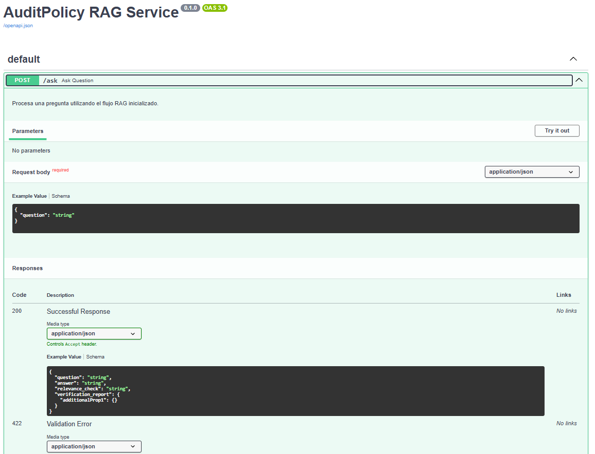
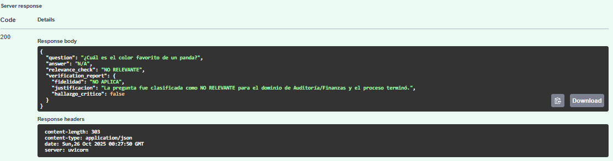

# Sistema-RAG-Multi-Agente-para-Auditoria-Financiera-AuditPolicy 🛡️

[](https://github.com/ADAA-404/Sistema-RAG-Multi-Agente-para-Auditoria-Financiera-AuditPolicy)
[](https://github.com/ADAA-404/Sistema-RAG-Multi-Agente-para-Auditoria-Financiera-AuditPolicy/blob/main/LICENSE)
<br>
[](https://fastapi.tiangolo.com/)
[](https://langchain.dev/)
[](https://www.trychroma.com/)
[-F05032?style=for-the-badge&logo=ollama)](https://ollama.com/)
[](https://www.python.org/)

Este proyecto implementa un sistema de Generación Aumentada por Recuperación (RAG) avanzado, diseñado para responder preguntas complejas de auditoría y contabilidad con alta fidelidad y robustez. Utiliza una arquitectura de Agentes de LangGraph para orquestar un flujo de trabajo de control de calidad exhaustivo, asegurando que las respuestas se basen estrictamente en la documentación de normas financieras (NIIF, NIC, SOX, etc.).

El objetivo es demostrar una solución empresarial de IA que prioriza la precisión, la trazabilidad y la estabilidad del backend (FastAPI) para su posible escalabilidad según se requiera.

## Fuente de Datos 💾

El proyecto utiliza un conjunto de documentos normativos y regulatorios comunes en la práctica de auditoría, incluyendo extractos de:

-   Normas Internacionales de Información Financiera (NIIF) y Normas Internacionales de Contabilidad (NIC).
-   Normativa de Estados Unidos (SOX) y directrices de implementación específicas (IFRIC).

Nota de Fidelidad: Las pruebas demuestran que la respuesta directa a consultas altamente específicas (ej. secciones detalladas de SOX o IFRIC) depende de la completitud del corpus de documentos cargados. El VerificationAgent funciona correctamente al marcar la fidelidad como BAJA cuando el contexto es insuficiente, demostrando la trazabilidad del sistema.

## Tecnologias usadas 🐍
Este proyecto es una demostración de la ingeniería de backend de IA generativa, utilizando unas opciones de tecnología robusta de Python:

-   LangGraph & LangChain: Orquestación avanzada del flujo de trabajo multi-agente y gestión del pipeline RAG.
-   FastAPI: Implementación del backend de la API RESTful de alto rendimiento para servir el servicio RAG.
-   Ollama (Llama 3.1): Servidor de Modelos de Lenguaje Locales, utilizado para la clasificación y la generación de respuestas, priorizando la privacidad y el bajo costo de inferencia.
-   ChromaDB: Base de datos vectorial persistente utilizada para el almacenamiento y la recuperación semántica de los embeddings.
-   HuggingFace Embeddings & BM25: Implementación de un CustomRetriever híbrido para la búsqueda precisa de documentos.
-   PyPDFLoader & RecursiveCharacterTextSplitter: Herramientas para la ingesta y preparación de documentos PDF de auditoría y normas.

## Consideraciones en Instalación ⚙️

Para configurar y ejecutar este servicio de API RAG, es importante entender los requisitos del flujo:

Ollama: Debe tener Ollama instalado y ejecutándose para servir el modelo llama3.1:8b.
bash:
    ```
    ollama run llama3.1:8b
    ```  
    
Entorno Python: Se recomienda utilizar un entorno virtual (conda).

Instale las bibliotecas de Python necesarias
bash:
    ```
    pip install -r requirements.txt
    # (o listar manualmente: langchain-core, langgraph, langchain-ollama, 
    # langchain-community, fastapi, uvicorn, pydantic, nltk)
    ```  
    
Configuración de Datos y Entorno
-   Cree una carpeta llamada Data Files en el directorio raíz del proyecto.
-   Coloque todos los archivos PDF de normativa (NIIF, SOX, etc.) dentro de la carpeta Data Files.
-   La primera ejecución realizará la Ingesta COMPLETA, creando el directorio chroma_db y el archivo persisted_chunks.pkl.

Y la ejecucion debe ser atrabes de la terminal a usar:
bash:
    ```
    uvicorn RAG_SYS_API:app --reload
    ```  

## Ejemplo de Uso 📎

El backend expone un único endpoint clave para las consultas RAG. Después de ejecutar el servidor a través de la terminal tendrás un despliegue del tipo http://localhost:8000/docs



La prueba de borde más importante para validar el RelevanceChecker es una pregunta fuera de dominio.   


El sistema termina el flujo de inmediato e inyecta un informe de verificación fake para evitar errores 500 en la API:



Una pregunta compleja que requiere síntesis y verificación tiene el resultado del relevance check (RELEVANTE) y el informe de verificación de calidad de acuerdo con los datos engestados.


## Contribuciones 🖨️

Si te interesa contribuir a este proyecto o usarlo independiente, considera:
-   Hacer un "fork" del repositorio.
-   Crear una nueva rama (`git checkout -b feature/su-caracteristica`).
-   Realizar tus cambios y "commiteelos" (`git commit -am 'Agrega nueva característica'`).
-   Subir los cambios a la rama (`git push origin feature/su-caracteristica`).
-   Abrir un "Pull Request".

Incluso en mejorar al sistema RAG se puede agregar más documentos normativos (SOX, IFRIC completos, circulares tributarias) en la carpeta Data Files (o de acuerdo como lo hayas probado). 
Experimentar con diferentes prompts para mejorar la síntesis en casos de contexto incompleto.


## Licencia 📜

Este proyecto está bajo la Licencia MIT. Consulta el archivo LICENSE (si aplica) para más detalles.

[English Version](README.en.md)
